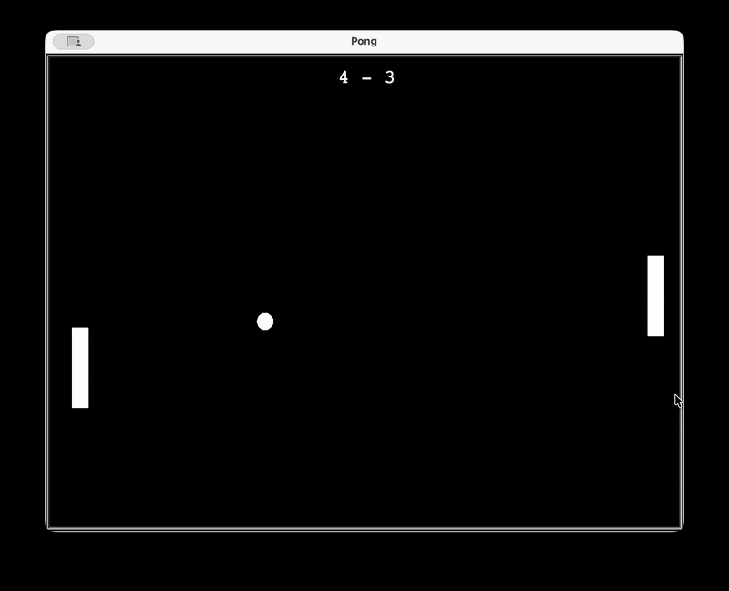
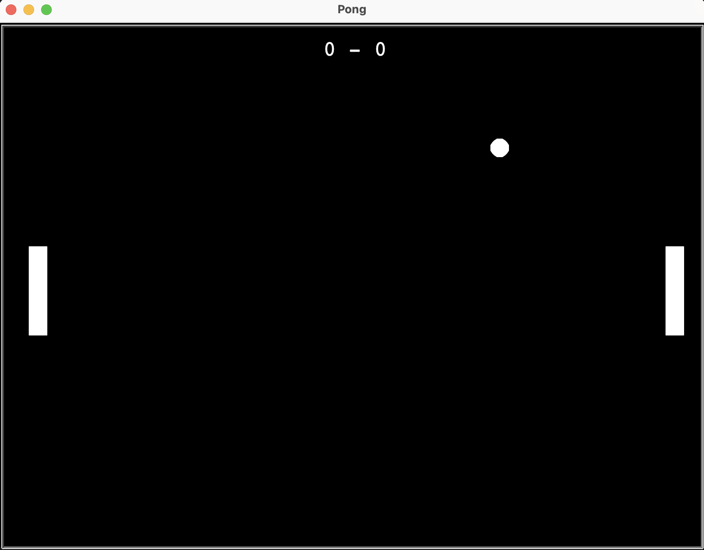
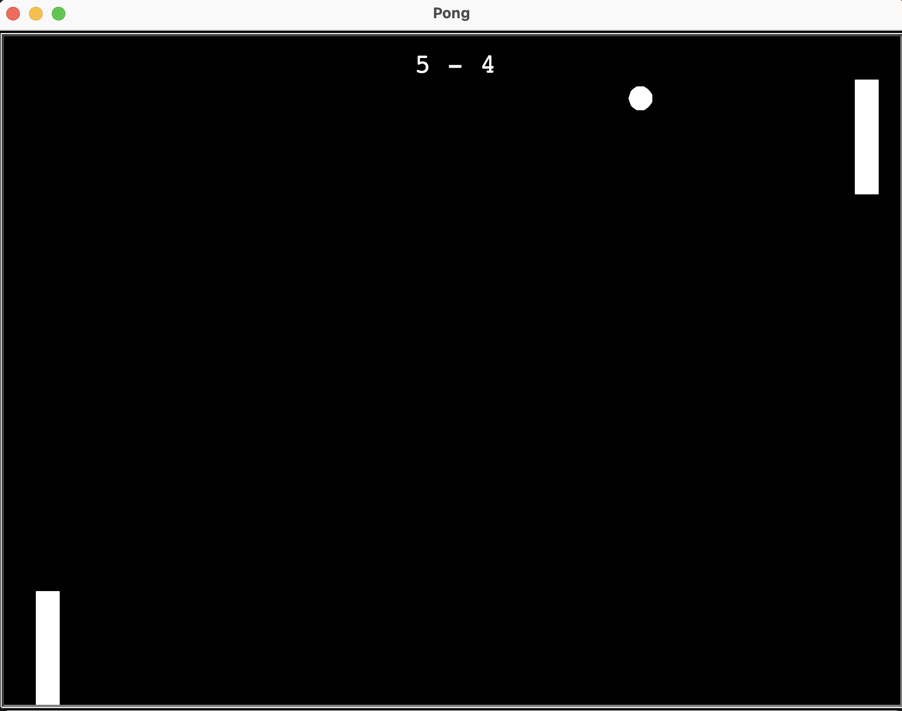
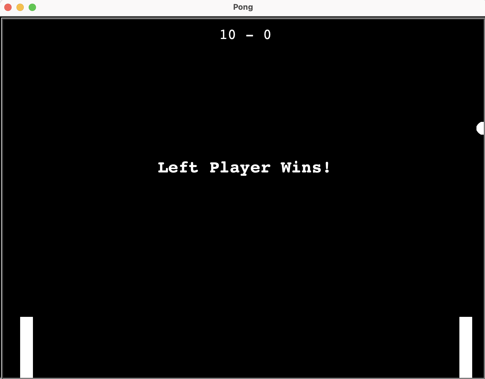

# 🏓 Pong Game

A classic two-player Pong game built with **Python** and the **Turtle** graphics library. This project was developed following Object-Oriented Programming (OOP) principles, with a clean architecture and separated responsibilities for each game component.

## Demo



## Screenshots

| Game Start                                          | Gameplay                                        | Winner                                             |
| --------------------------------------------------- | ----------------------------------------------- | -------------------------------------------------- |
|  |  |  |

## Features

- Two-player local gameplay
- Real-time score tracking
- Winner screen
- Ball acceleration after paddle collisions
- Paddle collision detection
- Configurable game settings
- Object-oriented architecture

## Technologies

- Python 3
- Turtle (Standard Library)
- Object-Oriented Programming (OOP)

## Project Structure

```text
Pong/
├── assets/
│   ├── pong-demo.gif
│   └── screenshots/
├── entities/
├── game/
├── config.py
├── main.py
├── README.md
├── requirements.txt
└── .gitignore
```

## Controls

| Player       | Keys  |
| ------------ | ----- |
| Left Player  | W / S |
| Right Player | ↑ / ↓ |

## Installation

```bash
git clone https://github.com/gerihawk/Pong.git
cd Pong
python main.py
```

## Architecture

### Architecture Overview

```text
main.py
    │
    ▼
  Game
 ├── Window
 ├── Ball
 ├── Scoreboard
 ├── Player (Left)
 │      └── Paddle
 └── Player (Right)
        └── Paddle
```

- **Game** – Coordinates the game loop and interactions between all entities.
- **Window** – Encapsulates the Turtle screen configuration.
- **Player** – Represents a player and delegates movement to its paddle.
- **Paddle** – Handles paddle movement and positioning.
- **Ball** – Manages movement, collisions, goals and round resets.
- **Scoreboard** – Displays and updates the score.

## Learning Outcomes

Through this project I practiced:

- Object-Oriented Programming (OOP)
- Encapsulation and separation of responsibilities
- Type hints and docstrings
- Project organization
- Refactoring and clean architecture
- Git and GitHub workflow

## Future Improvements

- Single-player mode with AI
- Sound effects
- Pause and restart menu
- Adjustable difficulty levels
- Improved collision physics

## License

## License

This project is licensed under the MIT License. See the `LICENSE` file for details.
